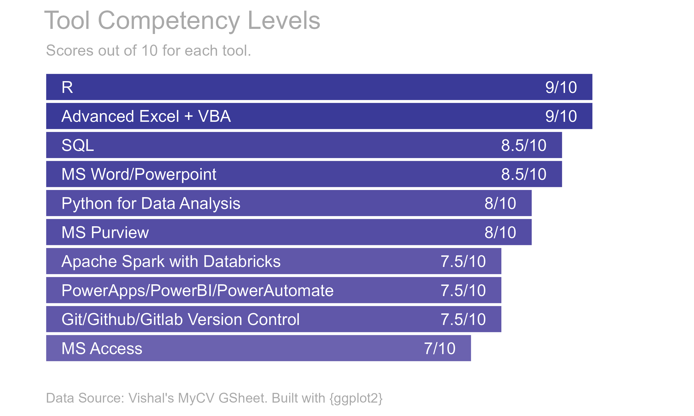

```{r setup, include=FALSE}
knitr::opts_chunk$set(echo = FALSE)
library(dplyr)
library(tidyr)
library(stringr)
library(lubridate)
library(ggplot2)
library(googlesheets4)
library(knitr)
#library(gt)
```

```{r gsheet, message=FALSE, warning=FALSE, comment=""}
gsheet <- "1W9duSTZ9hAhlV3yxFeM7qqIFc8Gca2utVe4WxMg0_1A"
gs4_auth(email = "katti.vishal@gmail.com")

skills         <- read_sheet(ss = gsheet, sheet = "Skills")
tools          <- read_sheet(ss = gsheet, sheet = "Tools")
highlights     <- read_sheet(ss = gsheet, sheet = "Highlights")
certifications <- read_sheet(ss = gsheet, sheet = "Certifications")
work           <- read_sheet(ss = gsheet, sheet = "Work")
education      <- read_sheet(ss = gsheet, sheet = "Education")

```

### Hi there :wave:

[](https://twitter.com/vishal_katti)

-   :telescope: New [Quarto website and blog hosted on Netlify](https://vishalkatti.com "https://vishalkatti.com").
-   :seedling: Full-time Business Data Analyst and part-time freelance consultant.
-   :dancers: Contributed to open-source, specifically to [openxlsx](https://cran.r-project.org/web/packages/openxlsx/) and [croquet](https://github.com/pcctc/croquet) R packages. Looking for opportunities to contribute more.
-   :thinking: I'm looking for full-time remote job at an org. that uses R extensively which will allow me to learn further and possibly teach others.
-   :speech_balloon: Ask me about how to automate your manual reports and other process improvement methods.
-   :mailbox: How to reach me: twitter *\@vishal_katti* or email *katti.vishal\@gmail.com*
-   :zap: Fun fact: The data in this .md file comes from a Google Sheet and is created with R and :sparkling_heart:

## :memo: Latest Blogs

<!-- BLOG-POST-LIST:START -->

<!-- BLOG-POST-LIST:END -->

## :wrench: Tools

```{r tools}
tools <- tools %>% mutate(Tool = factor(Tool, levels = c("MS Access", "Git/Github/Gitlab Version Control","PowerApps","Apache Spark with Databricks","Python for Data Analysis", "MS Word/Powerpoint","SQL", "Advanced Excel + VBA", "R"))) 
g <- ggplot(tools) +
  theme_minimal() +
  geom_col(aes(x = Score, y = Tool, fill = Score)) +
  geom_text(aes(x = 0.25, y = Tool, label = Tool), hjust = 0, color = "white", size = 3) +
  geom_text(aes(x = Score-0.25, y = Tool, label = paste0(Score,"/10")), hjust = 1, color = "white", size = 3) +
  expand_limits(x = c(0, 10), y = c(0,0)) +
  scale_fill_gradient2() +
  ggtitle("    Tool Competency Levels", 
       subtitle = "       Scores out of 10 for each tool.") +
  labs(caption = "        Data Source: Vishal's MyCV GSheet. Built with {ggplot2}") +
  theme(legend.position = "none",
        axis.title = element_blank(),
        axis.text = element_blank(),
        panel.grid = element_blank(),
        plot.caption = element_text(hjust = 0, size = 7, color = "darkgray"),
        plot.title = element_text(color = "darkgray"),
        plot.subtitle = element_text(color = "darkgray", size = 8, hjust = 0),
        panel.background = element_rect(fill = "transparent",colour = NA),
        plot.background = element_rect(fill = "transparent",colour = NA)
        )

ggsave(filename = "Images/tools.png", plot = g, bg = "transparent", dpi = 600, width = 5, height = 3)
```



## :dart: Certifications

```{r certs}
certifications %>% mutate(URL = glue::glue("[link]({URL})")) %>% kable()
```

## :briefcase: Work Experience

```{r work-exp}
exp_months <- as.period(Sys.Date() - as_date("2010-09-27")) %/% months(1)
exp_mon <- exp_months %% 12
exp_yrs <- exp_months %/% 12
```

**Total `r exp_yrs` Years `r exp_mon` Months Experience**

```{r work}
work %>% 
  replace_na(list(Employer = "",Loc = "")) %>% 
  mutate(
    From = format(lubridate::as_date(From),"%b %Y"),
    To = if_else(is.na(To), "Till Date",format(lubridate::as_date(To), "%b %Y"))
    ) %>% 
  setNames(c("Employer","Location","Role","From","To")) %>% 
  kable()
```

## :tada: Career Highlights

```{r highlights}
highlights %>% 
  mutate(Start = format(Start, "%b %Y"),
         End = format(End, "%b %Y"),
         When = if_else(is.na(End), Start, paste0(Start, "-", End))) %>% 
  select(-c(Start, End)) %>% 
  kable()
```

## :zap: Skills

```{r skills}
kable(skills)
```

## :books: Education

```{r education}
education %>% 
  mutate(From = format(From, "%b %Y"),
         To = format(To, "%b %Y")) %>% 
  kable()
```
