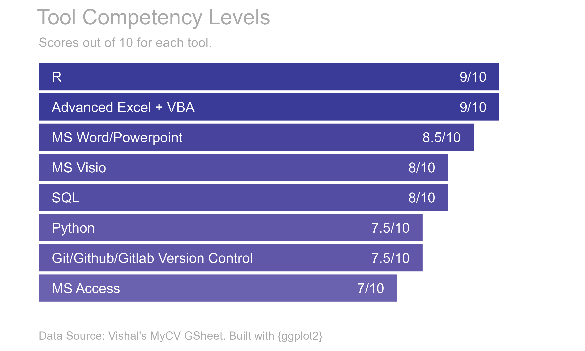

Vishal Katti
================

### Hi there :wave:

- :telescope: New [Quarto website and blog hosted on
  Netlify](https://vishalkatti.com "https://vishalkatti.com").
- :seedling: Full-time Business Data Analyst and part-time freelance
  consultant.
- :dancers: Contributed to open-source, specifically to
  [openxlsx](https://cran.r-project.org/web/packages/openxlsx/) and
  [croquet](https://github.com/pcctc/croquet) R packages. Looking for
  opportunities to contribute more.
- :thinking: I’m looking for full-time remote job at an org. that uses R
  extensively which will allow me to learn further and possibly teach
  others.
- :speech_balloon: Ask me about how to automate your manual reports and
  other process improvement methods.
- :mailbox: How to reach me: twitter *@vishal_katti* or email
  *katti.vishal@gmail.com*
- :zap: Fun fact: The data in this .md file comes from a Google Sheet
  and is created with R and :sparkling_heart:

## :memo: Latest Blogs

<!-- BLOG-POST-LIST:START -->
- [Pivoting your tables with Tidyr: Part II](https://vishalkatti.com/posts/tidyr-pivot-wider/index.html)
- [Pivoting your tables with Tidyr: Part I](https://vishalkatti.com/posts/tidyr-pivot-longer/index.html)
- [Writing Robust R Functions](https://vishalkatti.com/posts/writing-robust-functions/index.html)
- [Unholy Trinity of R, Excel VBA and Powerpoint - Part 2 of 2](https://vishalkatti.com/posts/R2VBA2PPT2/index.html)
- [Unholy Trinity of R, Excel VBA and Powerpoint - Part 1 of 2](https://vishalkatti.com/posts/R2VBA2PPT1/index.html)
<!-- BLOG-POST-LIST:END -->

## :wrench: Tools

## :dart: Certifications

| Certificate/Course Name                                    | Issuing Authority | Acquired on | URL                                                                             |
|:-----------------------------------------------------------|:------------------|:------------|:--------------------------------------------------------------------------------|
| Databricks Certified Data Engineering Associate            | DataBricks        | 2022-06-21  | [link](https://credentials.databricks.com/beaa10a2-1780-43b0-a277-2b9040e4046d) |
| R Programming A-Z™: R For Data Science With Real Exercises | Udemy             | 2017-12-28  | [link](ude.my/UC-9ZYZ24B9)                                                      |
| The Complete JavaScript Course: Build a Real-World Project | Udemy             | 2017-12-07  | [link](ude.my/UC-2Z7RF1SF)                                                      |

## :briefcase: Work Experience

**Total 12 Years 2 Months Experience**

| Employer                                                                | Location             | Role                       | From     | To        |
|:------------------------------------------------------------------------|:---------------------|:---------------------------|:---------|:----------|
| LTIMindtree Ltd. (Formerly Mindtree Ltd., now merged with L&T InfoTech) | Bengaluru, Karnataka | Business Data Analyst      | Sep 2021 | Till Date |
| ExxonMobil Services & Technology Pvt. Ltd                               | Bengaluru, Karnataka | Business Analytics Advisor | Oct 2020 | Aug 2021  |
|                                                                         |                      | Data Analyst               | Jun 2018 | Sep 2020  |
| Tata Consultancy Services Pvt. Ltd.                                     | Bengaluru, Karnataka | Data Analyst               | Jun 2016 | May 2018  |
|                                                                         | Mumbai, Maharashtra  | Functional Consultant      | Jan 2014 | May 2016  |
|                                                                         |                      | Business Analyst           | Oct 2011 | Dec 2013  |
|                                                                         |                      | Associate Systems Engineer | Jan 2011 | Sep 2011  |
|                                                                         | Trivandrum, Kerala   | Associate Systems Engineer | Sep 2010 | Dec 2010  |

## :tada: Career Highlights

| Highlights                                                                                                                                                          | Where                           | When              |
|:--------------------------------------------------------------------------------------------------------------------------------------------------------------------|:--------------------------------|:------------------|
| Received 7/7 performance rating for 4 Quarters in a row                                                                                                             | LTIMindtree Ltd.                | Oct 2021-Oct 2022 |
| Extended functionality and fixed Issue \#6 in R package {croquet} via Github pull request(<https://github.com/pcctc/croquet/pull/7>)                                | Open Source Contribution        | Sep 2022          |
| Extended conditional formatting feature and fixed Issue \#179 in R package {openxlsx} via Github pull request (<https://github.com/ycphs/openxlsx/pull/311>)        | Open Source Contribution        | Jan 2022          |
| Received customer appreciation for using Python for data cleaning and consolidation, which would otherwise take 2 weeks to do manually.                             | LTIMindtree Ltd.                | Oct 2021          |
| Added new conditional formatting feature to R package {openxlsx} via Github pull request (<https://github.com/ycphs/openxlsx/pull/166>)                             | Open Source Contribution        | Mar 2021-Apr 2021 |
| Designed and implemented critical in-house solution that replaces third-party vendor solution thereby saving \~50K USD in annual subcription cost                   | ExxonMobil, Bengaluru           | Jan 2021          |
| Designed and deployed 3 R packages for ExxonMobil OE-SSHE-DAG internal use.                                                                                         | ExxonMobil, Bengaluru           | Apr 2020-Jul 2020 |
| Awarded ‘Star of the Quarter’ for 2019 Q2 for designing the Report Automation Framework for OE-SSHE-DAG                                                             | ExxonMobil, Bengaluru           | Sep 2019          |
| Automated a report for SOC project using Excel VBA for Alert Analysis with Effort reduction from 8 hours to 5 minutes!!                                             | TCS, Bengaluru                  | Jul 2016          |
| Designed a critical solution which enabled TCS Talent Acquisition Group to roll out 66% more Offer Letters to TCS Applicants; thereby reducing Cost of Hire by 35%. | TCS, Mumbai                     | Aug 2015          |
| Worked on high priority Mobility project for TATA SONS Chairman Office as Functional Consultant/Analyst and Backup Project Manager.                                 | TCS, Mumbai                     | Aug 2014-Dec 2014 |
| Worked on high priority Mobility project for TCS CEO Office as Functional Consultant and Backup Project Manager.                                                    | TCS, Mumbai                     | Jan 2014-May 2014 |
| Received ‘On the Spot’ Award for ensuring TCS Internal IT Department’s entry into TATA INNOVISTA 2013. Chosen in Top 5 entries across the globe.                    | TCS, Mumbai                     | Jan 2014          |
| Initiated and implemented Trainee Management application, which helps manage around 45K candidates annually.                                                        | TCS, Mumbai                     | Jan 2011-Jul 2011 |
| Self-learnt, developed and deployed RMA Management stand-alone application (in MS Visual Basic) as part of 8 weeks internship during BTech Engineering.             | DLink India Pvt. Ltd, Verna-Goa | May 2009-Aug 2009 |

## :zap: Skills

| Skills                                                                | Tools                                                                                |
|:----------------------------------------------------------------------|:-------------------------------------------------------------------------------------|
| Data Cleansing, Feature Engineering, Data Modelling, Visualizations   | R, Python, Apache Spark with Databricks, MS Excel, PowerBI                           |
| Web Apps, Dashboards                                                  | R Shiny, Python, MS Excel, PowerBI, PowerApps                                        |
| SQL Queries & Reporting                                               | SQL Server, MS Access, Microsoft SQL Server Management Studio (SSMS), Databricks SQL |
| Data Analytics                                                        | R, Python, Apache Spark, MS Excel, PowerBI                                           |
| VBA Macros, Userforms, Excel Add-ins                                  | MS Excel, Word, Outlook, PowerPoint                                                  |
| Report Design                                                         | R, MS Excel, SQL, PowerBI, Word, PowerPoint                                          |
| Requirement Documentation and Change Request Management               | MS Word, Rally for Agile                                                             |
| Mockups, UI and Usability Design                                      | MS PowerPoint, Balsamiq Mockups for Desktop, MS Visio                                |
| Process Improvement                                                   | PDCA, Lean Six Sigma, VBA Automation                                                 |
| Test Planning, Test Cases, User Acceptance Testing, Defect Management | MS Excel, Rally for Agile                                                            |
| Project Management                                                    | \-                                                                                   |

## :books: Education

| Level                           | Specialization                        | Institute                                          | Location      | From     | To       |
|:--------------------------------|:--------------------------------------|:---------------------------------------------------|:--------------|:---------|:---------|
| Bachelor of Technology (B.Tech) | Instrumentation & Control Engineering | National Institute of Technology (NIT) Jalandhar   | Punjab, India | Aug 2005 | Apr 2010 |
| Higher Secondary (HSSC)         | Physics, Chemistry, Mathematics       | Smt. Parvatibai Chowgule College of Arts & Science | Goa, India    | Jun 2003 | Apr 2005 |
| Secondary (SSC)                 | \-                                    | Mahila & Nutan English Highschool                  | Goa, India    | Jun 2002 | Apr 2003 |
