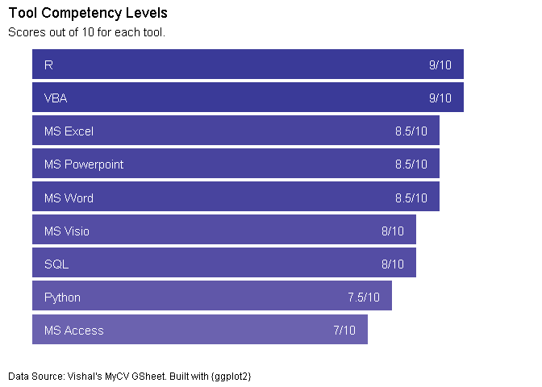

Vishal Katti
================

### Hi there 👋

  - 🔭 I’m currently working on building my personal Github profile. My
    work org. started using Github a few months ago for work-related
    collaboration, where I have moved all my R/Python automation scripts
    online. I have also developed a few internal R packages which are
    extensively used within my team.
  - 🌱 I’m currently learning Statistics with R from Coursera offered by
    Duke University. I am also learning to manage my productivity in
    this pandemic-induced work-from-home period.
  - 👯 I’m looking to collaborate on anything R related outside of my
    work network.
  - 🤔 I’m looking for career guidance.
  - 💬 Ask me about how R can help automate your Excel reports.
  - 📫 How to reach me: twitter
  - ⚡ Fun fact: The data in this .md file comes from Google Sheets and
    is created with R and 💖

## Work Experience

<!--html_preserve-->

<table class="gt_table">

<thead class="gt_header">

<tr>

<th colspan="4" class="gt_heading gt_title gt_font_normal" style>

Total 10 Years 3 Months Experience.

</th>

</tr>

<tr>

<th colspan="4" class="gt_heading gt_subtitle gt_font_normal gt_bottom_border" style>

</th>

</tr>

</thead>

<thead class="gt_col_headings">

<tr>

<th class="gt_col_heading gt_columns_bottom_border gt_left" rowspan="1" colspan="1">

Location

</th>

<th class="gt_col_heading gt_columns_bottom_border gt_left" rowspan="1" colspan="1">

Role

</th>

<th class="gt_col_heading gt_columns_bottom_border gt_left" rowspan="1" colspan="1">

From

</th>

<th class="gt_col_heading gt_columns_bottom_border gt_left" rowspan="1" colspan="1">

To

</th>

</tr>

</thead>

<tbody class="gt_table_body">

<tr class="gt_group_heading_row">

<td colspan="4" class="gt_group_heading">

ExxonMobil Services & Technology Pvt. Ltd

</td>

</tr>

<tr>

<td class="gt_row gt_left" style="font-weight: bold;">

Bengaluru, Karnataka

</td>

<td class="gt_row gt_left" style="font-weight: bold;">

Business Analytics Advisor

</td>

<td class="gt_row gt_left" style="font-weight: bold;">

Oct 2020

</td>

<td class="gt_row gt_left" style="font-weight: bold;">

Till Date

</td>

</tr>

<tr>

<td class="gt_row gt_left" style="font-weight: bold;">

Bengaluru, Karnataka

</td>

<td class="gt_row gt_left" style="font-weight: bold;">

Data Analyst

</td>

<td class="gt_row gt_left" style="font-weight: bold;">

Jun 2018

</td>

<td class="gt_row gt_left" style="font-weight: bold;">

Sep 2020

</td>

</tr>

<tr class="gt_group_heading_row">

<td colspan="4" class="gt_group_heading">

Tata Consultancy Services Pvt. Ltd.

</td>

</tr>

<tr>

<td class="gt_row gt_left" style="color: gray;">

Bengaluru, Karnataka

</td>

<td class="gt_row gt_left" style="color: gray;">

Data Analyst

</td>

<td class="gt_row gt_left" style="color: gray;">

Jun 2016

</td>

<td class="gt_row gt_left" style="color: gray;">

May 2018

</td>

</tr>

<tr>

<td class="gt_row gt_left" style="color: gray;">

Mumbai, Maharashtra

</td>

<td class="gt_row gt_left" style="color: gray;">

Functional Consultant

</td>

<td class="gt_row gt_left" style="color: gray;">

Jan 2014

</td>

<td class="gt_row gt_left" style="color: gray;">

May 2016

</td>

</tr>

<tr>

<td class="gt_row gt_left" style="color: gray;">

Mumbai, Maharashtra

</td>

<td class="gt_row gt_left" style="color: gray;">

Business Analyst

</td>

<td class="gt_row gt_left" style="color: gray;">

Oct 2011

</td>

<td class="gt_row gt_left" style="color: gray;">

Dec 2013

</td>

</tr>

<tr>

<td class="gt_row gt_left" style="color: gray;">

Mumbai, Maharashtra

</td>

<td class="gt_row gt_left" style="color: gray;">

Associate Systems Engineer

</td>

<td class="gt_row gt_left" style="color: gray;">

Jan 2011

</td>

<td class="gt_row gt_left" style="color: gray;">

Sep 2011

</td>

</tr>

<tr>

<td class="gt_row gt_left" style="color: gray;">

Trivandrum, Kerela

</td>

<td class="gt_row gt_left" style="color: gray;">

Associate Systems Engineer

</td>

<td class="gt_row gt_left" style="color: gray;">

Sep 2010

</td>

<td class="gt_row gt_left" style="color: gray;">

Dec 2010

</td>

</tr>

</tbody>

<tfoot class="gt_sourcenotes">

<tr>

<td class="gt_sourcenote" colspan="4">

Data Source: Vishal’s MyCV GSheet. Built with {gt}

</td>

</tr>

</tfoot>

</table>

<!--/html_preserve-->

| Employer                                  | Location             | Role                       | From     | To        |
| :---------------------------------------- | :------------------- | :------------------------- | :------- | :-------- |
| ExxonMobil Services & Technology Pvt. Ltd | Bengaluru, Karnataka | Business Analytics Advisor | Oct 2020 | Till Date |
| ExxonMobil Services & Technology Pvt. Ltd | Bengaluru, Karnataka | Data Analyst               | Jun 2018 | Sep 2020  |
| Tata Consultancy Services Pvt. Ltd.       | Bengaluru, Karnataka | Data Analyst               | Jun 2016 | May 2018  |
| Tata Consultancy Services Pvt. Ltd.       | Mumbai, Maharashtra  | Functional Consultant      | Jan 2014 | May 2016  |
| Tata Consultancy Services Pvt. Ltd.       | Mumbai, Maharashtra  | Business Analyst           | Oct 2011 | Dec 2013  |
| Tata Consultancy Services Pvt. Ltd.       | Mumbai, Maharashtra  | Associate Systems Engineer | Jan 2011 | Sep 2011  |
| Tata Consultancy Services Pvt. Ltd.       | Trivandrum, Kerela   | Associate Systems Engineer | Sep 2010 | Dec 2010  |

Total 10 Years 3 Months Experience.

## Career Highlights

<!--html_preserve-->

<table class="gt_table">

<thead class="gt_col_headings">

<tr>

<th class="gt_col_heading gt_columns_bottom_border gt_left" rowspan="1" colspan="1">

Highlights

</th>

<th class="gt_col_heading gt_columns_bottom_border gt_left" rowspan="1" colspan="1">

Where

</th>

<th class="gt_col_heading gt_columns_bottom_border gt_left" rowspan="1" colspan="1">

When

</th>

</tr>

</thead>

<tbody class="gt_table_body">

<tr>

<td class="gt_row gt_left">

Awarded ‘Star of the Quarter’ for 2019 Q2 for designing the Report
Automation Framework

</td>

<td class="gt_row gt_left">

ExxonMobil, Bengaluru

</td>

<td class="gt_row gt_left">

Sep 2019

</td>

</tr>

<tr>

<td class="gt_row gt_left">

Automated a report for SOC project using Excel VBA for Alert Analysis
with Effort reduction from 8 hours to 5 minutes\!\!

</td>

<td class="gt_row gt_left">

TCS, Bengaluru

</td>

<td class="gt_row gt_left">

Jul 2016

</td>

</tr>

<tr>

<td class="gt_row gt_left">

Designed a critical solution which enabled TCS Talent Acquisition Group
to roll out 66% more Offer Letters to TCS Applicants; thereby reducing
Cost of Hire by 35%.

</td>

<td class="gt_row gt_left">

TCS, Mumbai

</td>

<td class="gt_row gt_left">

Aug 2015

</td>

</tr>

<tr>

<td class="gt_row gt_left">

Worked on high priority Mobility project for TATA SONS Chairman Office
as Functional Consultant/Analyst and Backup Project Manager.

</td>

<td class="gt_row gt_left">

TCS, Mumbai

</td>

<td class="gt_row gt_left">

Aug 2014-Dec 2014

</td>

</tr>

<tr>

<td class="gt_row gt_left">

Worked on high priority Mobility project for TCS CEO Office as
Functional Consultant and Backup Project Manager.

</td>

<td class="gt_row gt_left">

TCS, Mumbai

</td>

<td class="gt_row gt_left">

Jan 2014-May 2014

</td>

</tr>

<tr>

<td class="gt_row gt_left">

Received ‘On the Spot’ Award for ensuring TCS Internal IT Department’s
entry into TATA INNOVISTA 2013. Chosen in Top 5 entries across the
globe.

</td>

<td class="gt_row gt_left">

TCS, Mumbai

</td>

<td class="gt_row gt_left">

Jan 2014

</td>

</tr>

<tr>

<td class="gt_row gt_left">

Initiated and implemented Trainee Management application, which helps
manage around 45K candidates annually.

</td>

<td class="gt_row gt_left">

TCS, Mumbai

</td>

<td class="gt_row gt_left">

Jan 2011-Jul 2011

</td>

</tr>

<tr>

<td class="gt_row gt_left">

Self-learnt, developed and deployed RMA Management stand-alone
application (in MS Visual Basic) as part of 8 weeks internship during
BTech Engineering.

</td>

<td class="gt_row gt_left">

DLink India Pvt. Ltd, Verna-Goa

</td>

<td class="gt_row gt_left">

May 2009-Aug 2009

</td>

</tr>

</tbody>

<tfoot class="gt_sourcenotes">

<tr>

<td class="gt_sourcenote" colspan="3">

Data Source: Vishal’s MyCV GSheet. Built with {gt}

</td>

</tr>

</tfoot>

</table>

<!--/html_preserve-->

## Skills

<!--html_preserve-->

<table class="gt_table">

<thead class="gt_col_headings">

<tr>

<th class="gt_col_heading gt_columns_bottom_border gt_left" rowspan="1" colspan="1">

Skills

</th>

<th class="gt_col_heading gt_columns_bottom_border gt_left" rowspan="1" colspan="1">

Tools

</th>

</tr>

</thead>

<tbody class="gt_table_body">

<tr>

<td class="gt_row gt_left">

Web Apps, Dashboards

</td>

<td class="gt_row gt_left">

R, Shiny

</td>

</tr>

<tr>

<td class="gt_row gt_left">

Data Cleansing, Feature Engineering, Data Modelling, Visualizations

</td>

<td class="gt_row gt_left">

R, Python, MS Excel, PowerBI

</td>

</tr>

<tr>

<td class="gt_row gt_left">

Data Analytics

</td>

<td class="gt_row gt_left">

MS Excel, SAP Business Objects, MS PowerBI

</td>

</tr>

<tr>

<td class="gt_row gt_left">

VBA Macros, Userforms, Excel Add-ins

</td>

<td class="gt_row gt_left">

MS Excel, Word, Outlook, PowerPoint

</td>

</tr>

<tr>

<td class="gt_row gt_left">

Report Design

</td>

<td class="gt_row gt_left">

SAP Business Objects, MS Excel, Word, PowerPoint

</td>

</tr>

<tr>

<td class="gt_row gt_left">

SQL Queries & Reporting

</td>

<td class="gt_row gt_left">

SQL Server, MS Access, Microsoft SQL Server Management Studio

</td>

</tr>

<tr>

<td class="gt_row gt_left">

Requirement Documentation and Change Request Management

</td>

<td class="gt_row gt_left">

MS Word, Application LifeCycle Manager (ALM), Rally for Agile

</td>

</tr>

<tr>

<td class="gt_row gt_left">

Mockups, UI and Usability Design

</td>

<td class="gt_row gt_left">

Balsamiq Mockups for Desktop, MS Visio, MS PowerPoint

</td>

</tr>

<tr>

<td class="gt_row gt_left">

Project Management

</td>

<td class="gt_row gt_left">

\-

</td>

</tr>

<tr>

<td class="gt_row gt_left">

Process Improvement

</td>

<td class="gt_row gt_left">

PDCA, Lean Six Sigma, VBA Automation

</td>

</tr>

<tr>

<td class="gt_row gt_left">

Automation/Manual Testing

</td>

<td class="gt_row gt_left">

TCS Selenium X, TCS MasterCraft ALM

</td>

</tr>

<tr>

<td class="gt_row gt_left">

Test Planning, Test Cases, User Acceptance Testing, Defect Management

</td>

<td class="gt_row gt_left">

TCS MasterCraft ALM, MS Excel, Rally for Agile

</td>

</tr>

</tbody>

<tfoot class="gt_sourcenotes">

<tr>

<td class="gt_sourcenote" colspan="2">

Data Source: Vishal’s MyCV GSheet. Built with {gt}

</td>

</tr>

</tfoot>

</table>

<!--/html_preserve-->

<!-- -->

## Education

<!--html_preserve-->

<table class="gt_table">

<thead class="gt_col_headings">

<tr>

<th class="gt_col_heading gt_columns_bottom_border gt_left" rowspan="1" colspan="1">

Level

</th>

<th class="gt_col_heading gt_columns_bottom_border gt_left" rowspan="1" colspan="1">

Specialization

</th>

<th class="gt_col_heading gt_columns_bottom_border gt_left" rowspan="1" colspan="1">

Institute

</th>

<th class="gt_col_heading gt_columns_bottom_border gt_left" rowspan="1" colspan="1">

Location

</th>

<th class="gt_col_heading gt_columns_bottom_border gt_left" rowspan="1" colspan="1">

From

</th>

<th class="gt_col_heading gt_columns_bottom_border gt_left" rowspan="1" colspan="1">

To

</th>

</tr>

</thead>

<tbody class="gt_table_body">

<tr>

<td class="gt_row gt_left">

Bachelor of Technology (B.Tech)

</td>

<td class="gt_row gt_left">

Instrumentation & Control Engineering

</td>

<td class="gt_row gt_left">

National Institute of Technology (NIT) Jalandhar

</td>

<td class="gt_row gt_left">

Punjab, India

</td>

<td class="gt_row gt_left">

Aug 2005

</td>

<td class="gt_row gt_left">

Apr 2010

</td>

</tr>

<tr>

<td class="gt_row gt_left">

Higher Secondary (HSSC)

</td>

<td class="gt_row gt_left">

Physics, Chemistry, Mathematics

</td>

<td class="gt_row gt_left">

Smt. Parvatibai Chowgule College of Arts & Science

</td>

<td class="gt_row gt_left">

Goa, India

</td>

<td class="gt_row gt_left">

Jun 2003

</td>

<td class="gt_row gt_left">

Apr 2005

</td>

</tr>

<tr>

<td class="gt_row gt_left">

Secondary (SSC)

</td>

<td class="gt_row gt_left">

\-

</td>

<td class="gt_row gt_left">

Mahila & Nutan English Highschool

</td>

<td class="gt_row gt_left">

Goa, India

</td>

<td class="gt_row gt_left">

Jun 2002

</td>

<td class="gt_row gt_left">

Apr 2003

</td>

</tr>

</tbody>

<tfoot class="gt_sourcenotes">

<tr>

<td class="gt_sourcenote" colspan="6">

Data Source: Vishal’s MyCV GSheet. Built with {gt}

</td>

</tr>

</tfoot>

</table>

<!--/html_preserve-->
